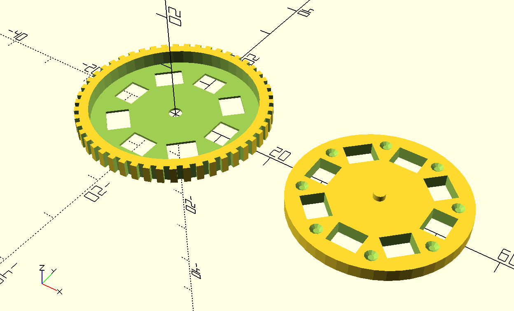

# A Slideshow Wheel

It started from this conversation: 

[https://mastodon.social/@thomasjwebb/110131667820154776
](https://mastodon.social/@thomasjwebb/110131667820154776)

And I felt like it'd be a fun mental exercise before bed.  Here's the result:

RE: 'tolerance' variable:

General tolerance for friction-fit parts is 0.2mm. Double that because we're subtracting it from the diameter, not the radius and it's 0.4. 

Which is the same width of your print nozzle, which sets wall thickness. And if you print at 0.35mm layer height it's very nearly 1 layer. 

* 2 layers on female part
* 2 walls on the ridges
* 0.2mm tolerance

Hope it works!
